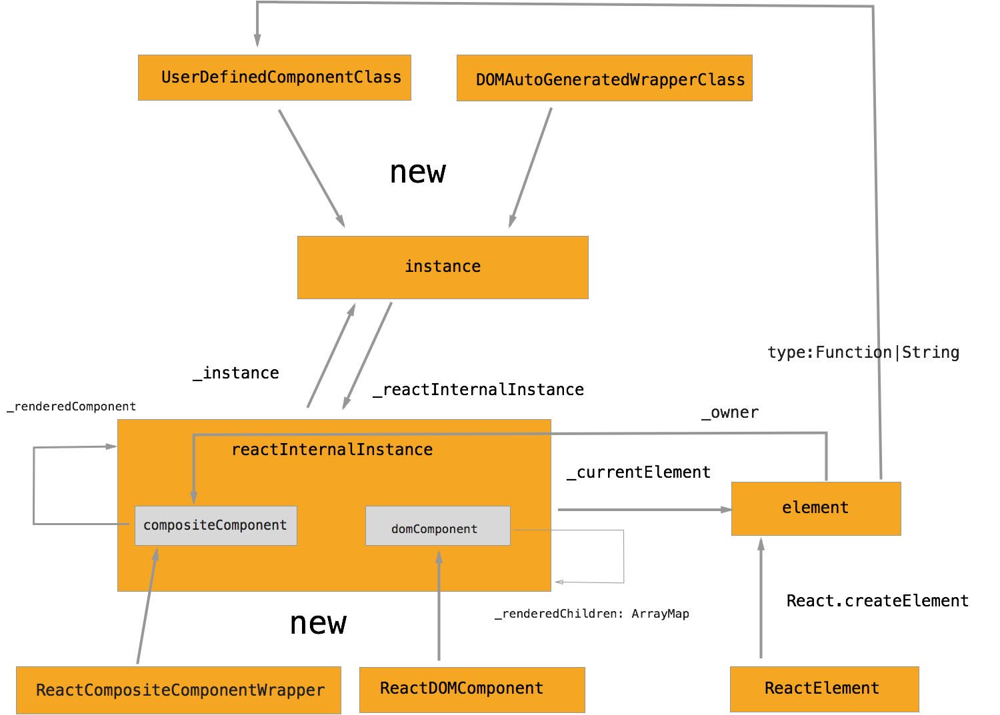

# React Object Model

author: yiminghe@gmail.com

http://blog.yiminghe.me/2015/04/14/react-object-model/




## Classes and Objects

### UserDefinedComponentClass

user can define custom component class by call React.createClass or extend React.Component

```js
class UserDefinedComponentClass extends React.Component{}

var UserDefinedComponentClass2 = React.createClass();
```

### DOMAutoGenerateWrapperClass

component class represents native DOM nodes

```js
// source from react
function autoGenerateWrapperClass(type) {
  return ReactClass.createClass({
    tagName: type.toUpperCase(),
    render: function() {
      // Copy owner down for debugging info
      var internalInstance = ReactInstanceMap.get(this);
      return new ReactElement(
        type,
        null,  // key
        null,  // ref
        internalInstance._currentElement._owner,  // owner
        null,  // context
        this.props
      );
    }
  });
}
```

### ReacCompositeComponentWrapper

React internal class for render custom component and DOM component to native platform.

### ReactDOMComponent

React internal class for render DOM component to native platform in the end.

### ReactElement/element

class for virtual DOM node (element), element's type field will be the paramter passed to React.createElement.

```js
var custom = <My />; //React.createElement(My);
var div=<div/>;//React.createElement('div');
div instanceof ReactElement //true
custom instanceof ReactElement //true
```


### instance

instance of UserDefinedComponentClass or DOMAutoGenerateWrapperClass, it links to React internal class instance by _reactInternalInstance field.


### reactInternalInstance

there are two types of React internal class instance: compositeComponent and domComponent.

#### compositeComponent

element will link to it by _owner field. owner is the component which element is created from its render() method.

It also link to component class instance by _instance field, instance and reactInternalInstance are 1-1.

It links to React internal class instance transformed from its render() method's return value by _renderComponent field, so render method can not return array.

## domComponent

In the end, it all goes to domComponent, dom component will render its children recursively(_renderedChildren), each of its children is a React internal class instance.

```js
<div>  // domComponent
<a> // domComponent
1 // domTextComponent
</a>
<My /> // compositeComponent
</div>
```
